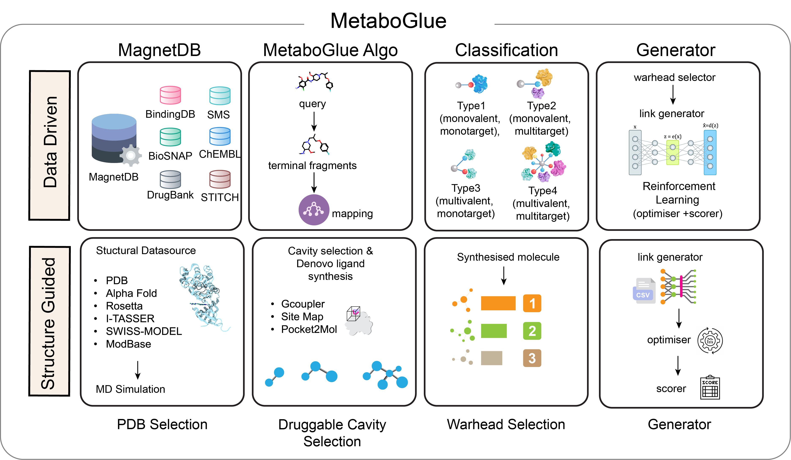

# Readme


# SynGlue: A Generative AI Toolkit for PROTAC Design

**SynGlue** is a powerful Python package built to accelerate the discovery and design of complex PROTACs (Proteolysis Targeting Chimeras) using generative AI. Tailored for researchers and developers in polypharmacology and drug discovery, SynGlue offers an end-to-end suite of tools for generating PROTACs and prioritising as well

 <br>
<div align="center">
</div>
<br>

----


[](https://colab.research.google.com/github/YOUR_USERNAME/YOUR_REPO/blob/main/notebook.ipynb)
[](https://github.com/YOUR_USERNAME/YOUR_REPO)
[](https://github.com/YOUR_USERNAME/YOUR_REPO/blob/main/notebook.ipynb)


## Features

- **Generative AI Models**: Leverage AI to design and optimize PROTACs and Multi-targeting Molecules.
- **ALgorithm** : Fast Fragment Based TRIE data storage algorithm.
- **Polypharmacology**: Classify molecules based on type and target mapping.
- **Flexible API**: Easily integrate SynGlue into your workflows with a RESTful API powered by FastAPI.
- **Cheminformatics Support**: Tools for molecular representation, manipulation, and analysis powered by RDKit.
- **Modular Design**: SynGlue is built with multiple modules to perform tasks like browsing, computing , annotating, mapping  and molecules.
  
## Installation

### Install from PyPI

```bash
pip install SynGlue

```

### Clone and Install Locally

```bash
git clone <https://github.com/the-ahuja-lab/SynGlue.git>
cd SynGlue
pip install .

```


## SynGlue Workflow

SynGlue offers a two-part approach:

1. **Data-Driven**
    - Utilize structural databases to extract terminal fragments, ligands, and target mappings.
    - Map input molecules, annotate types and targets, and generate optimized molecules.
2. **Structure-Guided**
    - Input structures from databases like PDB, AlphaFold, or Rosetta.
    - Use the **GCoupler** module to synthesize molecules till Authenticator.
    - Employ warhead selection and scoring tools for optimization.

## Data-Driven Modules

### 1. **MagnetDB Database**

- Browse through compound data and visualize results.
- Backend: A database containing terminal fragments, ligands, and their targets.

### 2. **Computator**

- Map queries to relevant compound data and retrieve matching ligands and fragments.

### 3. **Annotator**

- Annotate compounds with molecular type, target information, and functional groups.

### 4. **Warhead Mapper**

- Map potential warheads for specific targets during drug design workflows.

### 5. **Generator**

- Generate new molecules based on input data.
- Includes:
    - **Optimizer**: Fine-tune generated structures.
    - **Scorer**: Rank generated molecules.

## Structure-Guided Modules

### 1. **PDB Selection**

- Use protein structures from databases like PDB, AlphaFold, or Rosetta.

### 2. **De Novo Molecule Synthesis**

- Synthesize molecules based on druggable cavities using third-party tools like GCoupler, SiteMap, or Pocket2mol.

### 3. **Warhead Mapper**

- Map and rank the top synthesized molecules for specific targets.

### 4. **Generator**

- Generate new molecules based on input data.
- Includes:
    - **Optimizer**: Fine-tune generated structures.
    - **Scorer**: Rank generated molecules.

## Dependencies

- **fastapi** (v0.95.2) — API server
- **uvicorn** (v0.22.0) — ASGI server for FastAPI
- **requests** (v2.31.0) — HTTP requests
- **pandas** (v1.5.3) — Data manipulation
- **rdkit** (v2023.03.1) — Cheminformatics toolkit
- **setuptools** (v67.6.1) — Python packaging
- **biopython** (v1.81) — Bioinformatics tasks
- **matplotlib** (v3.7.1) — Data visualization
- **scikit-learn** (v1.2.2) — Machine learning
- **seaborn** (v0.12.2) — Data visualization
- **scipy** (v1.10.1) — Scientific computing
- **tqdm** (v4.65.0) — Progress bars

## License

SynGlue is licensed under the MIT License. See [LICENSE](https://www.notion.so/saveenasolanki/LICENSE) for more details.

## Acknowledgments

- Thanks to the **RDKit team** for their powerful cheminformatics toolkit.
- Gratitude to the contributors and maintainers of **FastAPI**, **Uvicorn**, and other open-source libraries used in this project.

## Summary

SynGlue is a comprehensive toolkit that combines **data-driven** and **structure-guided** methodologies to design and analyze PROTACs. It enables researchers to:

- Map and annotate molecules with structural and functional insights.
- Optimize molecular generation workflows for drug discovery.
- Integrate easily into existing pipelines via a RESTful API.


